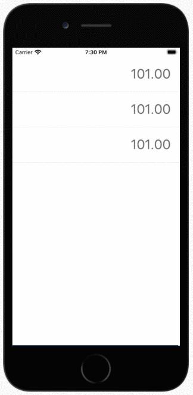

# React Native Numpad

A simple React Native number pad for quickly updating multiple number inputs.

[](https://badge.fury.io/js/react-native-numpad)
[](https://expo.io/)

- ✅ **No Dependencies**
- ✅ iOS
- ✅ Android
- ✅ React Native Web
- ✅ JS-Only (No Native Code / No Linking Necessary)



## Demo 👉 <a href="https://snack.expo.io/@git/github.com/glancemoney/react-native-numpad" target="_blank">Expo Snack</a>

## Install

```
yarn add react-native-numpad
```

## Use Cases

- Splitting expenses
- Forms with multiple number inputs
- Spreadsheets
- Calculators

## Usage

```js
import React from 'react';
import NumberPad, { Input, Display } from './index';

export default () => (
  <NumberPad>
    <Display key={0} cursor value={1.0} />
    <Display key={1} cursor value={2.5} />
    <Input />
  </NumberPad>
);
```

## Custom Icons

```js
import React from 'react';
import NumberPad, { Input, Display } from './index';
import { Ionicons } from '@expo/vector-icons';

export default () => (
  <NumberPad>
    <Display key={0} cursor value={1.0} />
    <Display key={1} cursor value={2.5} />
    <Input
      backspaceIcon={<Ionicons icon="ios-backspace" {...Input.iconStyle} />}
      hideIcon={<Ionicons icon="ios-arrow-down" {...Input.iconStyle} />}
    />
  </NumberPad>
);
```

## API

Under the hood, `react-native-numpad` uses the [React Context API](https://reactjs.org/docs/context.html) to link the number inputs (the `<Display>`s) to the number pad (the `<Input>`).

### `<NumberPad>` Component

The `<NumberPad>` component is a [HOC (Higher Order Component)](https://reactjs.org/docs/higher-order-components.html) that does not accept any props besides `children`. It creates a `reactNativeNumpad` context that listens for press events on the number inputs, opens the number input when it detects a press, and then updates the input values when the user presses on the number buttons in the number pad.

### `<Display>` Component

The `<Display>` is the number pad's equivalent of React Native's [`<TextInput>`](https://reactnative.dev/docs/textinput) component. It is a [controlled component](https://reactjs.org/docs/forms.html#controlled-components) that, when pressed, opens the number pad.

| Prop                       | Description                                                                                      | Default |
| -------------------------- | ------------------------------------------------------------------------------------------------ | ------- |
| **`value`**                | Current value of the input (number only)                                                         | _None_  |
| **`style`**                | Any valid style object for [`<TouchableOpacity>`](https://reactnative.dev/docs/touchableopacity) | _None_  |
| **`textStyle`**            | Any valid style object for a [`<Text>`](https://reactnative.dev/docs/text) component             | _None_  |
| **`activeStyle`**          | Any valid style object for a [`<Text>`](https://reactnative.dev/docs/text) component             | _None_  |
| **`invalidTextStyle`**     | Any valid style object for a [`<Text>`](https://reactnative.dev/docs/text) component             | _None_  |
| **`placeholderTextStyle`** | Any valid style object for a [`<Text>`](https://reactnative.dev/docs/text) component             | _None_  |
| **`cursorStyle`**          | Any valid style object for a [`<View>`](https://reactnative.dev/docs/view) component             | _None_  |
| **`blinkOnStyle`**         | Any valid style object for a [`<View>`](https://reactnative.dev/docs/view) component             | _None_  |
| **`blinkOffStyle`**        | Any valid style object for a [`<View>`](https://reactnative.dev/docs/view) component             | _None_  |
| **`onChange`**             | An event handler function that receives the new value (number) as an argument                    | _None_  |
| **`cursor`**               | Whether or not to show the cursor when the input is focused (boolean)                            | true    |
| **`autofocus`**            | Whether or not to autofocus the input when the component is loaded (boolean)                     | false   |

### `<Input>` Component

The `<Input>` a custom number pad keyboard that, unlike the native keyboard, does not minimize when the user presses on a new number input if it is already open. It is stylable and easy to customize.

| Prop                | Description                                                                                                      | Default                  |
| ------------------- | ---------------------------------------------------------------------------------------------------------------- | ------------------------ |
| **`height`**        | Height of the number pad                                                                                         | 270                      |
| **`position`**      | How the number pad will be positioned                                                                            | 'absolute' \| 'relative' |
| **`style`**         | Any valid style object for a [`<View>`](https://reactnative.dev/docs/view) component (`Animated.View`, actually) | _None_                   |
| **`backspaceIcon`** | An Icon element (eg from `react-native-vector-icons` or `@expo/vector-icons`)                                    | _None_                   |
| **`hideIcon`**      | An Icon element (eg from `react-native-vector-icons` or `@expo/vector-icons`)                                    | _None_                   |
| **`onWillHide`**    | Called just before the number pad will hide                                                                      | _None_                   |
| **`onDidHide`**     | Called just after the number pad hides                                                                           | _None_                   |
| **`onWillShow`**    | Called just before the number pad will show                                                                      | _None_                   |
| **`onDidShow`**     | Called just after the number pad shows                                                                           | _None_                   |

### `<AvoidingView>` Component

Sometimes React Native's built-in [<KeyboardAvoidingView>](https://reactnative.dev/docs/keyboardavoidingview) does not work smoothly with the number pad: it can either have performance issues where animations are choppy or it can be difficult to configure its height properly altogether. We've included a number pad context-aware version that adjusts it's height based on the keyboard animation to achieve a smooth frame rate.

| Prop        | Description                                                                                                      | Default |
| ----------- | ---------------------------------------------------------------------------------------------------------------- | ------- |
| **`style`** | Any valid style object for a [`<View>`](https://reactnative.dev/docs/view) component (`Animated.View`, actually) | _None_  |

## Version History (Change Log)

View [here](./CHANGELOG.md).

## Contribute

We welcome contributions! If you are interested in contributing, consider helping us with one of the following tasks:

- Rewrite components in TypeScript using arrow-function components and [React hooks](https://reactjs.org/docs/hooks-intro.html)
- Add TypeScript bindings
- Add Tests

## Glance Money

[](https://glance.money)

We wrote this for, actively use, and maintain this library for [Glance Money](https://glance.money). Now it is free and open for the world to use ❤️

## License

[MIT licensed.](./LICENSE)
